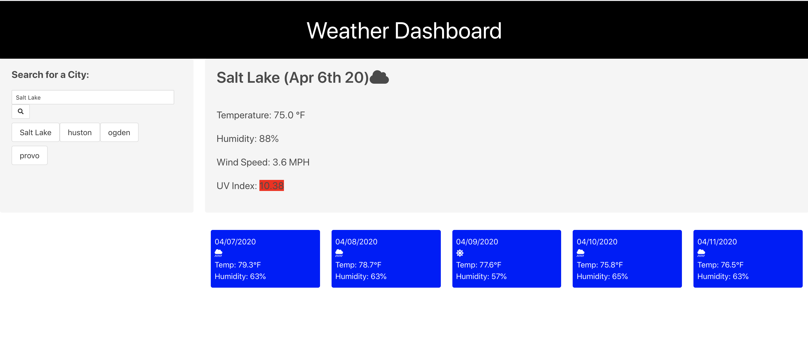

# WeatherDashboard
This page asks the user to input a city, then returns current weather and conditions, and conditions for the next 5 days

## Creating the Weather Dashboard

A lot of things clicked for me in this project. I was able to use a lot less html code, and rely more on javaScript. I was also able to make the javascript more versatile, using functions, if statements and for loops, as opposed to hard-coded script that I was over-using in the past. I feel that grasping more onto these concepts was a huge milestone for me personally. I am very happy about the functionality that I was able to implement and proud of what I was able to get done.

## Room for improvement

In our group project, we are using the CSS framework Bulma. I decided to use this framework for this project as well, to familiarize myself with it. I liked the ease of use of this framework and how responsive it is. However, I could not utilize it and it's features as much I would have liked. I concentrated more on the functionality and script, and in turn I sacrificed on the front-end.

I was not able to get the local storage to function, nor was I able to get the buttons for the past searches to function. I left a little bit of pseudo code of what I had in mind. I abandoned this part of the homework because I did not want to slack on my portion of the group project that we are currently working on. I believe I could have gotten the buttons to function. I do know that I need to improve my grasp on local storage more. I made some some improvements last assignment, but couldn't utilize it in the way I wanted to one this one. 
  
## Link to Project
[Weather Dashboard](https://benbknight.github.io/WeatherDashboard/)

## Picture
 
